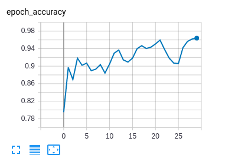

 

 

Classification is one of the most popular tasks in deep learning. Here's a real world example of using this technology  to determine a US vehicle license plate's jurisdiction.

Here we used a ResNet50V2 as body, one single FC layer before softmax output. So how well does this simple model perform? It probably performs better than you expected. In my test, it at least matches and in many cases outperforms a well trained human operator(aka me). The very few cases it gets wrong result is when the plate is vanity plate with a totally different look absent in the training set.

